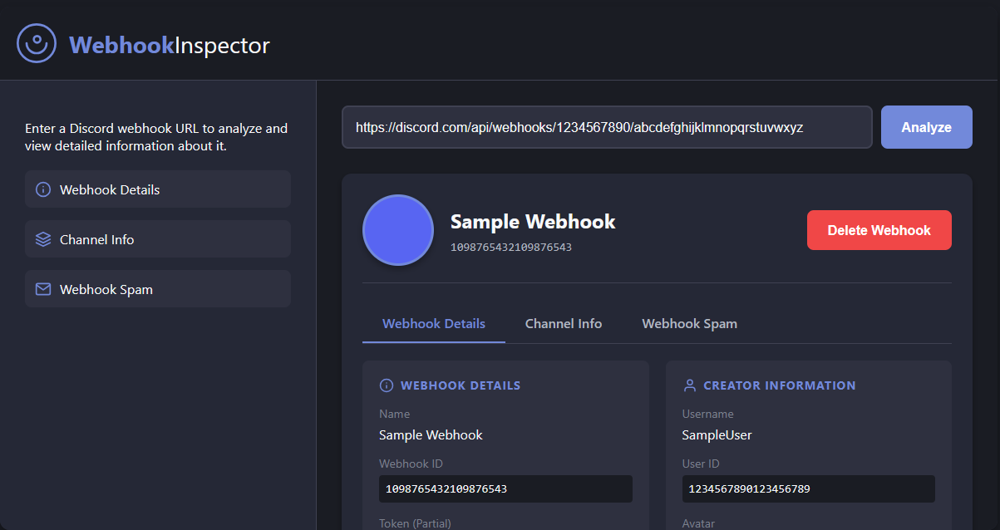

# Discord Webhook Inspector

Discord webhook'lerini analiz etmek, test etmek ve yönetmek için güçlü bir web tabanlı araç.

## Özellikler

- **Webhook Analizi**: Discord webhook'lerini analiz ederek detaylı bilgileri görüntüleme
- **Kanal Bilgileri**: Webhook ile ilişkili kanal ve sunucu detaylarını görüntüleme
- **Webhook Silme**: Arayüzden doğrudan webhook'leri silme
- **Webhook Spam**: Özelleştirilebilir ayarlarla birden fazla mesaj gönderme
  - Gönderilecek tam mesaj sayısını ayarlama
  - Mesajlar arasındaki gecikmeyi yapılandırma (milisaniye cinsinden)
  - Mesajlar için kullanıcı adı ve avatar özelleştirme
  - Hedef sayıya ulaşılana kadar ısrarlı gönderim

## Nasıl Kullanılır

### Webhook Analizi

1. Giriş alanına bir Discord webhook URL'si girin
2. Webhook bilgilerini getirmek ve görüntülemek için "Analiz Et" düğmesine tıklayın
3. Üç sekme arasında detaylı bilgileri görüntüleyin:
   - Webhook Detayları: İsim, ID, token, oluşturma tarihi ve tür
   - Kanal Bilgileri: Kanal ID, Sunucu ID ve Uygulama ID
   - Webhook Spam: Mesaj gönderme araçları

### Webhook Spam Özelliği

Webhook Spam özelliği, özelleştirilebilir ayarlarla bir webhook'e birden fazla mesaj göndermenizi sağlar:

- **Mesaj**: Her mesajda gönderilecek içerik
- **Mesaj Sayısı**: Başarıyla teslim edilecek mesaj sayısı (1-1000)
- **Mesajlar Arası Gecikme**: Mesaj gönderimi arasında beklenecek süre (0-10000ms)
- **Kullanıcı Adı**: Görüntülenecek özel kullanıcı adı (isteğe bağlı)
- **Avatar URL**: Görüntülenecek özel avatar URL'si (isteğe bağlı)

Sistem, bazı denemeler başarısız olsa bile, istenen tam sayıda mesajı başarıyla teslim edene kadar göndermeye devam edecektir.

### Demo Modu

Test amaçlı örnek verilerle arayüzü görmek için "Demo Görüntüle" düğmesine tıklayın.

## Teknik Detaylar

- Saf HTML, CSS ve JavaScript ile oluşturulmuştur
- Harici bağımlılık veya framework gerektirmez
- Duyarlı tasarım masaüstü ve mobil cihazlarda çalışır
- Varsayılan olarak karanlık mod, aydınlık mod geçiş seçeneği ile

## Gizlilik ve Güvenlik

- Tüm işlemler tarayıcınızda gerçekleşir - hiçbir veri herhangi bir sunucuya gönderilmez
- Webhook URL'leriniz ve token'larınız asla saklanmaz veya iletilmez
- Uygulama yüklendikten sonra çevrimdışı çalışır

## Kurulum

Kurulum gerektirmez! Sadece `index.html` dosyasını herhangi bir modern web tarayıcısında açın.

## Demo

Uygulamanın canlı demosunu test etmek için: [https://sweet-pithivier-b2fefe.netlify.app/](https://sweet-pithivier-b2fefe.netlify.app/)

## Geliştirici

- **Developer**: shareyxrd
- **Ücretli İşler İçin Instagram**: [shareyxrd](https://www.instagram.com/shareyxrd/)

## Katkıda Bulunma

Katkılarınızı bekliyoruz! Uygulamayı geliştirmek için sorun bildirimleri veya çekme istekleri gönderebilirsiniz.

## Lisans

Bu proje MIT Lisansı altında lisanslanmıştır - detaylar için LICENSE dosyasına bakın.
